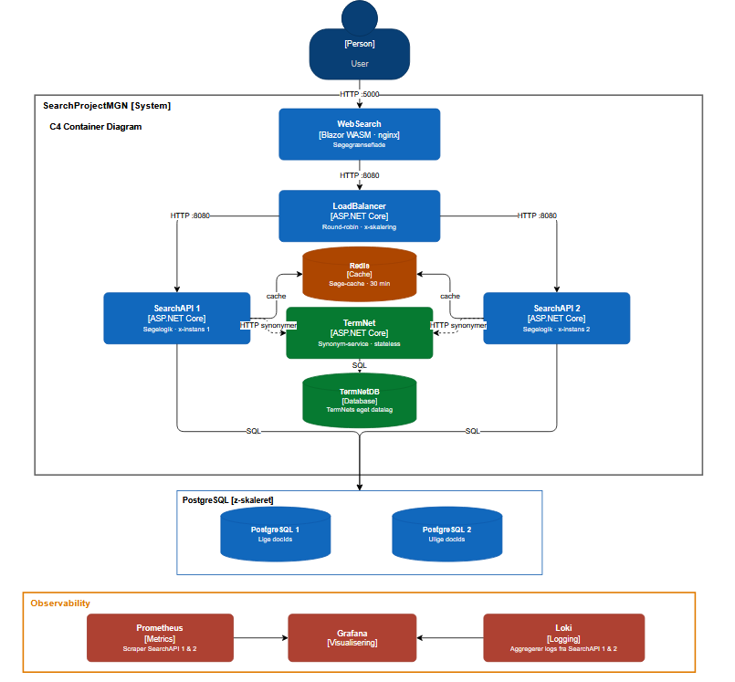

# SearchEngineProject

A distributed search engine built as a microservice architecture in .NET 10, developed as a 6th semester exam project. The system demonstrates X-, Y- and Z-axis scaling via load balancing, service separation and database sharding.

## Architecture



## Services

| Service | Description |
|---|---|
| **WebSearch** | Blazor WebAssembly frontend served by nginx |
| **LoadBalancer** | Round-robin load balancer across SearchAPI instances |
| **SearchAPI** | Core search logic — indexes words, ranks documents by hit count |
| **TermNet** | Synonym service for query expansion |
| **Redis** | Result cache with 30 minute TTL |
| **PostgreSQL 1 & 2** | Z-axis sharded search index (even/odd document IDs) |

## Scaling

- **X-axis**: Two SearchAPI instances behind a load balancer
- **Y-axis**: Separate microservices for search, synonyms, and UI
- **Z-axis**: Search index sharded across two PostgreSQL databases by `docId % 2`

## Running the project

```bash
docker-compose up
```

The web interface is available at `http://localhost:5000`.
